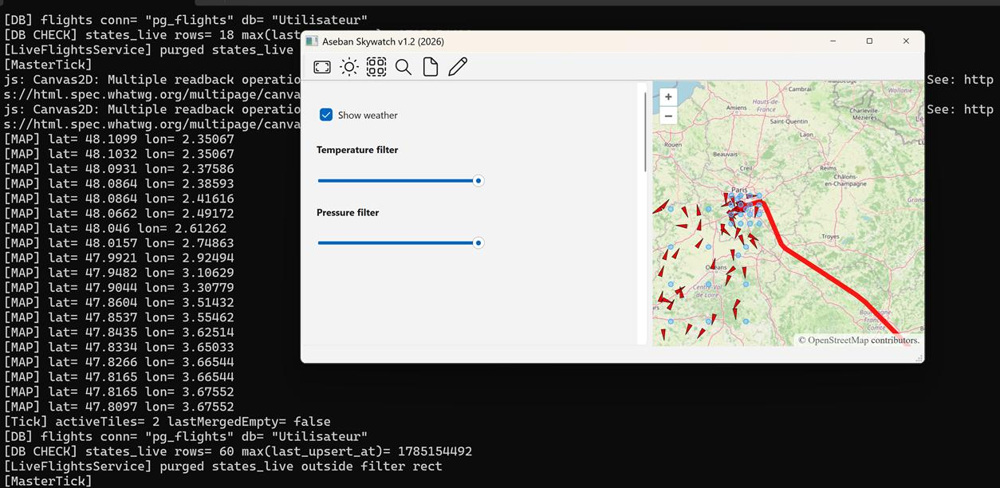
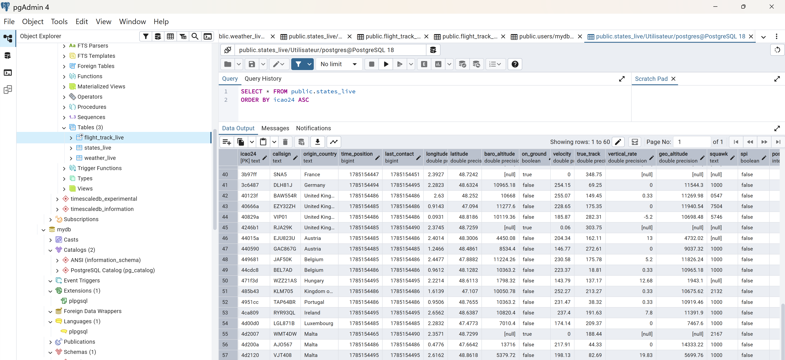

# Aseban SkyWatch

Aseban SkyWatch is a C++20 desktop application for real-time aircraft and weather visualization.

The application retrieves live aircraft state vectors from the OpenSky Network, combines them with OpenWeather data, and displays the results through an interactive web map embedded in a Qt interface.

## Features

* Live aircraft state acquisition from OpenSky
* Weather data acquisition from OpenWeather
* Interactive aircraft visualization on a web-based map
* Geographic area and map-tile calculations
* Native C++ and JavaScript communication through Qt WebChannel
* Asynchronous HTTP requests using Qt Network
* Aircraft and weather data models
* Modular fetcher, service, controller, and view components

## Technology Stack

* C++20
* Qt 6
* Qt Widgets
* Qt Network
* Qt WebEngine
* Qt WebChannel
* Qt Positioning
* Qt SQL
* CMake
* OpenSky Network API
* OpenWeather API
* HTML, CSS, and JavaScript map interface

## Architecture

```text
OpenSky API ───────► OpenSky Fetcher ───────► Live Flights Service
                                                       │
OpenWeather API ───► OpenWeather Fetcher ───► Live Weather Service
                                                       │
                                                       ▼
                                              Qt Application Layer
                                                       │
                                                       ▼
                                               WebChannel Bridge
                                                       │
                                                       ▼
                                             Embedded Web Map
```

## Project Structure

```text
AsebanSkyWatch/
├── config/
├── src/
│   ├── backend/
│   │   ├── compute/
│   │   ├── fetch/
│   │   ├── models/
│   │   └── services/
│   ├── gui/
│   │   ├── controllers/
│   │   └── views/
│   ├── main/
│   └── utils/
├── CMakeLists.txt
└── README.md
```

### Backend

* `fetch/` contains the OpenSky and OpenWeather HTTP clients.
* `services/` manages live aircraft and weather updates.
* `models/` contains aircraft and weather data structures.
* `compute/` contains experimental computation modules.

### GUI

* `views/` contains the Qt desktop interface.
* `controllers/` manages communication between Qt and the embedded map.
* Qt WebChannel connects the C++ backend to the JavaScript frontend.

### Utilities

* Geographic coordinate processing
* Map-tile calculations
* Bounding-area calculations

## Requirements

* CMake 3.21 or newer
* C++20-compatible compiler
* Qt 6 with:

  * Core
  * Gui
  * Widgets
  * Network
  * SQL
  * WebChannel
  * Positioning
  * WebEngineCore
  * WebEngineWidgets
* OpenSky API credentials
* OpenWeather API key

## Build

```bash
cmake -S . -B build
cmake --build build --config Release
```

The project can also be opened directly through `CMakeLists.txt` in Qt Creator.

## Configuration

The application reads OpenSky and OpenWeather credentials from JSON configuration files located in the `config` directory.

Credential files are excluded from version control.

## Experimental TPI Module

The repository contains an experimental TPI computation prototype based on rolling windows and robust statistical calculations.

This module is not functional, is not integrated into the active application workflow, and is no longer under development.

## Current Status

Implemented:

* OpenSky data acquisition
* OpenWeather data acquisition
* Qt desktop interface
* Interactive map integration
* Native-to-web communication
* Live aircraft and weather services
* Geographic processing utilities

Not currently implemented:

* Historical trajectory persistence
* Production database integration
* Automated test suite
* Release packaging
* Cloud deployment
* Production monitoring


## Screenshots

### Main GUI & backend beta v1.2



### TimescaleDB underlying hypertable example



### 


## License

This project is licensed under the MIT License. See the [LICENSE](https://github.com/albertmm96/myWorks/blob/main/AsebanSkyWatch/LICENSE) for details.